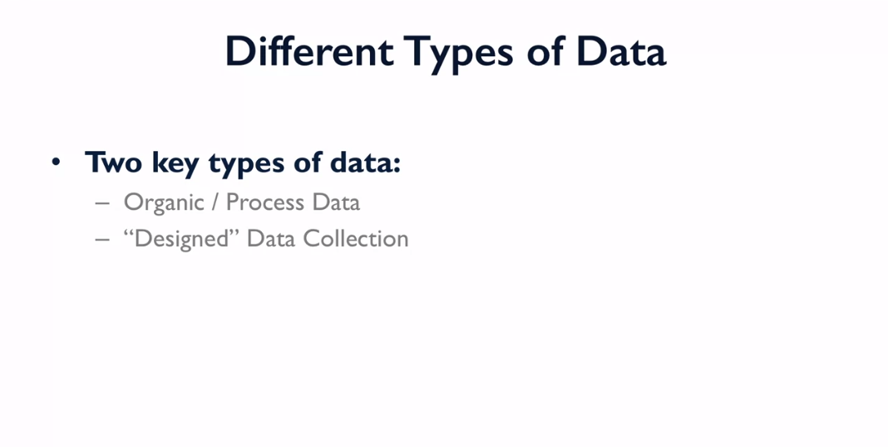
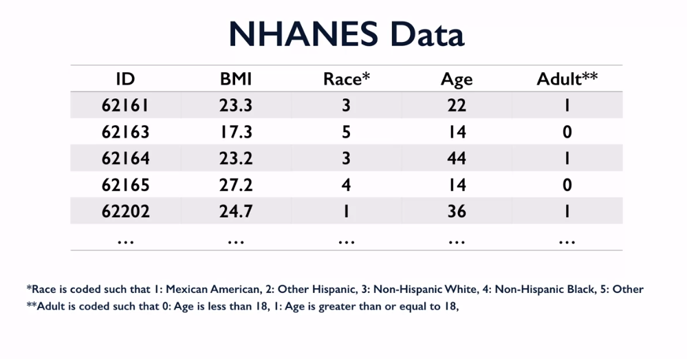

# Understanding and visualizing Data with Python

## What is Statistics?

## History of Statistics Milestones

## Statistics and its Allied Fields

### Resources 
* [This is statistics](http://thisisstatistics.org/)
* Articles about statistic projects
	* [Change the world](http://www.amstat.org/asa/files/pdfs/StatSig/StatSigEnvironment.pdf)
	* [Having fun](http://www.amstat.org/asa/files/pdfs/StatSig/StatSigSports.pdf)
	* [Earning great money](http://thisisstatistics.org/wp-content/uploads/2016/05/Salaries_Medium.jpg)

## Cool Stuff in Data Today

Here are some statistics project examples
* [A day in the life of americans](https://flowingdata.com/2015/12/15/a-day-in-the-life-of-americans/)
* [American workday](https://flowingdata.com/2017/05/17/american-workday/)
* [Most common use of time, by age and sex](https://flowingdata.com/2015/11/30/most-common-use-of-time-by-age-and-sex/)

## Where the data come from

Organic: these are data that are generated by a computerized information system or maybe extracted from video or audio recordings. The common point is that they're generated organically as the result of some process and they're often generated over time.

So, what does that really mean? Observations on a variable of interest in the i.i.d case are completely independent of all observations. So, there's no correlation between the different measurements that are collected from different units in the population, different stock market exchanges, different baseball games, different individuals who are responding to a survey, all those observations are independent of all the other observations that might ultimately make up a data set. In addition, all of the values that we actually observe arise from some common statistical distribution, so that's the identically distributed part of i.i.d. So all the observations are independent of all the other observations and the values that we're looking at are all arising from some common statistical distribution, that's where the i.i.d terminology comes from.

## Variables Types

## Study design

The goal is to compare one quantity to another.

## Data Management and Manipulation

Data management refers to all steps of data processing that occur after the data are collected but before the actual data analysis.

Most statistical software operates predominantly on rectangular arrays of data in which the rows represent cases and the columns represent variables. In most statistical analysis, the cases represent individual units in the population of interest, although in some settings the distinction between cases and variables is not very clear.

### A Typical Rectangular Data Set

Data for a study on medical expenditures might appear as seen in the image below. In addition to the subject ID, the variables are “Age”, “State” (of residence), and (medical) “Expenditures."

|ID|Age|State|Expenditures|
|---|---|---|---|
|132414|33|	OK|	375  |
|454543|25|	LA|	1450 |
|232134|41|	CA|	908  |
|314132|55|	TX|	3480 |
|453255|46|	MI|	0    |
|543545|35|	CO|	8550 |
|342342|28|	VT|	320  |
|563654|41|	NY|	24350|
|465566|27|	SC|	1850 |

### Best Practices for Data Management
* Never modify the source data files (you want to preserve a record of the data as you received it).
* Write a script (e.g. a Python program) to generate your analysis files from the source data files.

Advantages of this approach: If new source data arrives, the analysis files can be updated using the script. Also, complex data management can be reproduced and is documented through the code in the script.

* Name variables with brief interpretable names.
* Short variable names convey too little meaning, and very long names are awkward to use in complex expressions
* Variable names consisting only of letters (a-z, case sensitive), numbers (not as the first character) and the underscore character (_) will be handled easily by most statistical software.
* Whitespace in variable names is allowed in Python/Pandas, but confuses analysis based on formulas. To avoid this, use (for example) "birth_date" instead of "birth date".
* Most statistical software will treat blank, “NA”, or “.” as a missing value.

### Spreadsheet Software
* Spreadsheet software can be useful for getting a quick overview of a data set, but is quite limited for more advanced data management and analysis.
* Font style and text color in a spreadsheet are generally not interpretable by statistical software so should not be used to encode important information.
* Spreadsheet graphs and charts will generally be ignored when importing spreadsheet data into statistical software.
* Each sheet in a spreadsheet workbook is usually imported as a separate dataset.
* Python can read most Excel files directly, but may struggle with large, complex, or very old files.
* Text/CSV is a better choice than spreadsheet formats (e.g. .xlsx) for data exchange and archiving.

### Data Files for Storage and Exchange
Text/CSV is currently the most universal format for data exchange.

* The data in a CSV file is “delimited”, usually by a comma or a tab.
* Large data sets can be saved in compressed form (e.g. using “gzip”) and read into statistical software directly from the compressed file. This allows the data to be read much faster, and reduces storage space.

Some statistical software packages have proprietary binary file formats (e.g. SAS7BDAT for SAS or DTA for Stata). These can usually be read directly into Python/Pandas but in some cases challenges arise. Formats like XML and JSON are useful for non-rectangular data but tend to produce larger files that are slower to read and process.

### Repeated Measures Data: Wide and Long
“Repeated measures” arise when multiple measurements are made on each subject in a study.

Statistical analysis of repeated measures data is a more advanced topic, but you may encounter this type of data and need to do some basic reporting and data management with it.

Two common formats for repeated measures data are:

* Wide format: one row per subject
 Long format: one row per measurement

Python/Pandas has tools to convert between wide and long form.

Wide Form Data

The wide form data below could come from a longitudinal study of BMI (Body Mass Index) in which BMI at ages 25, 30, and 40 are obtained for each subject.

| ID|Birth_state|	BMI_25	|BMI_30	|BMI_40|
|---|---|---|---|---|
| 1|OK|	26| 	26| 	28|
| 2|MI|	23| 	22| 	29|
| 3|FL|	21| 	28| 	26|

Long Form Data
The same data in long format would appear as follows:

|ID|	Birth_state	|Agei|	BMI|
|---|---|---|---|---|
|1|	OK	|25	|26|
|1|	OK	|30	|26|
|1|	OK	|40	|27|
|2|	MI	|25	|23|
|2|	MI	|30	|22|
|2|	MI	|40	|28|
|3|	FL	|25	|21|
|3|	FL	|30	|28|
|3|	FL	|40	|25|

Uses of wide and long format data layouts

*Wide format is slightly more convenient for data entry in studies where each subject is assessed the same number of times.
*Long format is more flexible, as it accommodates measures obtained at arbitrary time points; the long format is also more natural for many forms of statistical analysis, such as regression analysis

More Specialized Data Formats

Other specialized data layouts exist for other types of data, e.g. data defined as graphs (networks of nodes and edges), images, geospatial data, or text data.
