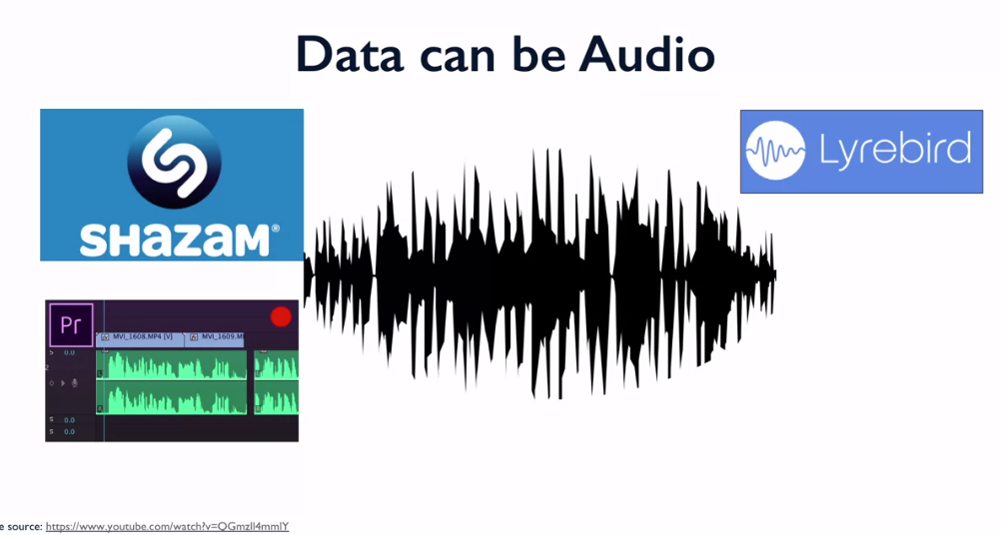
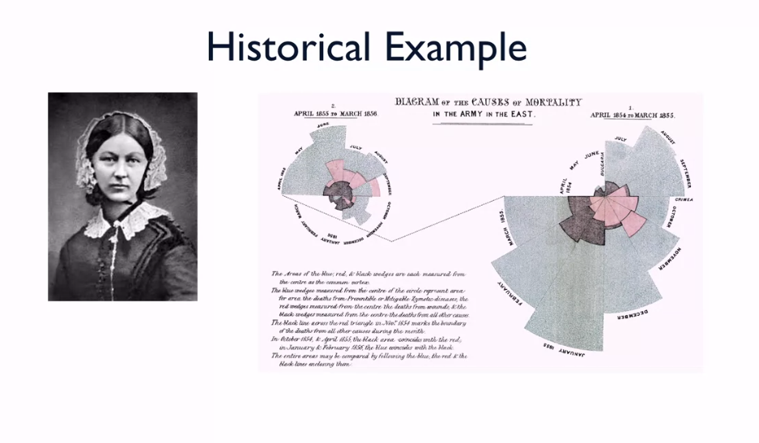

# Understanding and visualizing Data with Python

## What is Statistics?

## History of Statistics Milestones

## Statistics and its Allied Fields

### Resources 
* [This is statistics](http://thisisstatistics.org/)
* Articles about statistic projects
	* [Change the world](http://www.amstat.org/asa/files/pdfs/StatSig/StatSigEnvironment.pdf)
	* [Having fun](http://www.amstat.org/asa/files/pdfs/StatSig/StatSigSports.pdf)
	* [Earning great money](http://thisisstatistics.org/wp-content/uploads/2016/05/Salaries_Medium.jpg)

## Cool Stuff in Data Today

