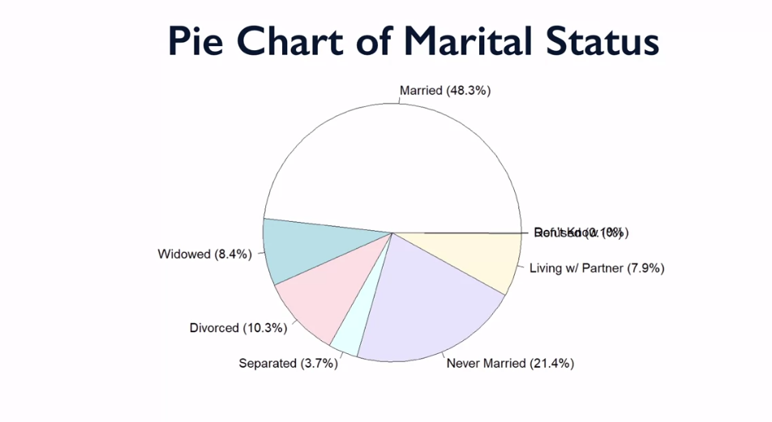

# Univariate Data
## Categorical Data: Tables, Bar Charts & Pie Charts

## Quatitative Data: Histograms

---

---

## Quatitative Data: Numerical Summaries

## Standard Scores: Empirical Rule

For bell-shaped distributions, we ga out one, two and three standard deviations and expect 68-95-97.7 percent of our observations to fall on those ranges

Let's calculate the standard score

## Quatitative Data, Graphical Summary: Boxplots

## Demo: interactive Histogram & Boxplot

* [Data Visualization](https://markkurzejaumich.shinyapps.io/bivariate_analysis/)

## Resources 
* [What's going on in this graph](https://www.nytimes.com/column/whats-going-on-in-this-graph)
* [National Poll on Children's Health](https://mottpoll.org/infographics)

## Modern Infographics

The word infographic comes from a combination of the words “information” and “graphic”.  While there are no clear definitions for infographics, generally, these figures should display information with varying levels complexity and sophistication to the viewer in a clear and concise way.

This modern--or not so modern-- technique can take many shapes and forms.  Infographics themselves are not a new concept; many basic forms of infographics were first introduced in the 1800s.  In fact, many of the charts that you have seen and will see in this course are simple infographics, like pie charts, bar charts, histograms, and scatter plots.   Objects such as weather and subway maps are standard ways of displaying and distributing large, complex amounts of information clearly and quickly to users.  Well-designed weather maps, for example, are especially helpful in that consistent coloring allows for quick comprehension of information.
<figure></figure>
<a href="https://www.flickr.com/photos/ursonate/8140171988" target="_blank" rel="noopener nofollow"><em>Boston, MA Doppler Weather Radar Map - Accuweather.com</em></a><em> by </em><a href="https://www.flickr.com/photos/ursonate/" target="_blank" rel="noopener nofollow"><em>charlene mcbride</em></a><em> licensed under </em><a href="https://creativecommons.org/licenses/by/2.0/" target="_blank" rel="noopener nofollow"><em>CC BY 2.0</em></a>

One of the innovations to the infographic that increased its visibility is the development of the USA Snapshots by USA Today in 1982 to add images to simple graphs.  The increased illustrations and colors added eye-appeal and extra interest in the information presented.  The use of color images in newspapers are often limited to the front and back page of each newspaper, so these graphics were often seen by consumers of the newspaper.
<figure></figure>

With the internet and the massive explosion of social networking sites, Pinterest, and blogs, along with new tools and programs for image editing, infographics have recently exploded in a different way.  These infographics exist in almost every format imaginable, whether it be a timeline or an <a href="https://www.dorkly.com/post/72753/which-fictional-princess-is-best" target="_blank" rel="noopener nofollow">extended visualization of which Disney princess contains the best qualities</a> or a <a href="https://xkcd.com/388/" target="_blank" rel="noopener nofollow">ranking of fruit by tastiness and difficulty of eating</a>.  These infographics may be published by reputable sources, like<a href="https://mottpoll.org/infographics" target="_blank" rel="noopener nofollow"> Mott’s Children’s Hospital</a> or generated by unofficial or untrustworthy sources.

Due to their rise in number, quantity of authors, and questionable reputability, it is important to assess the quality and correctness of infographics.  There are many ways in which infographics can lie or suggest stories that are contained within the data itself. 

Some quick tips for assessing how good the data in infographics are:
<ul><li>Look for the source of the information.  Are there competing interests?</li><li>Check the scale of the data. Many pieces of information can be hidden or exaggerated based on how the scale is generated.</li><li>While visualizations can be cute, think about how all dimensions of a graph scale.  For example, scaling up the height of an object by two will quadruple the two dimensional volume.</li></ul>
So, keep an eye out for infographics in your daily life.  During one hour, count how many you see to determine how prevalent they truly are.  Assess their correctness based on the underlying data and practice good consumption of information through this format. If you are generating infographics yourself, remember that the clearer you present your information, the clearer and more persuasive your argument will be.

For some of our favorite infographics, check out:
<ul><li><a href="http://thedailyviz.com/2016/09/17/how-common-is-your-birthday-dailyviz/" target="_blank" rel="noopener nofollow">How common your birthday is in the US</a></li><li><a href="https://mottpoll.org/infographics/2091" target="_blank" rel="noopener nofollow">How parents think about organ donation</a></li></ul>

<strong>And if you're interested in learning more, please review the following resources.</strong>

For general information about infographics, check out:
<ul><li><a href="https://www.smithsonianmag.com/history/surprising-history-infographic-180959563/" target="_blank" rel="noopener nofollow">Infographic history</a></li><li><a href="https://www.edwardtufte.com/tufte/" target="_blank" rel="noopener nofollow">The work of Edward Tufte</a></li><li><a href="https://www.brainpickings.org/index.php/2013/10/08/best-american-infographics-david-byrne/" target="_blank" rel="noopener nofollow">How to Be an Educated Consumer on Infographics: David Byrne on the Art-science of Visual Storytelling</a></li></ul>
For more general thoughts on infographics and assessing information, consider looking into:
<ul><li><a href="https://www.amazon.com/How-Lie-Statistics-Darrell-Huff/dp/0393310728" target="_blank" rel="noopener nofollow">How Statistics Lie.</a></li><li><a href="http://www.storytellingwithdata.com/" target="_blank" rel="noopener nofollow">Storytelling with Data</a></li><li></li></ul>

