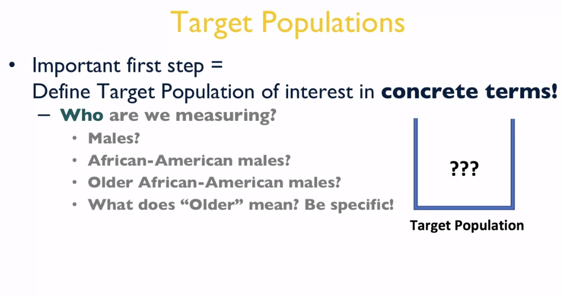
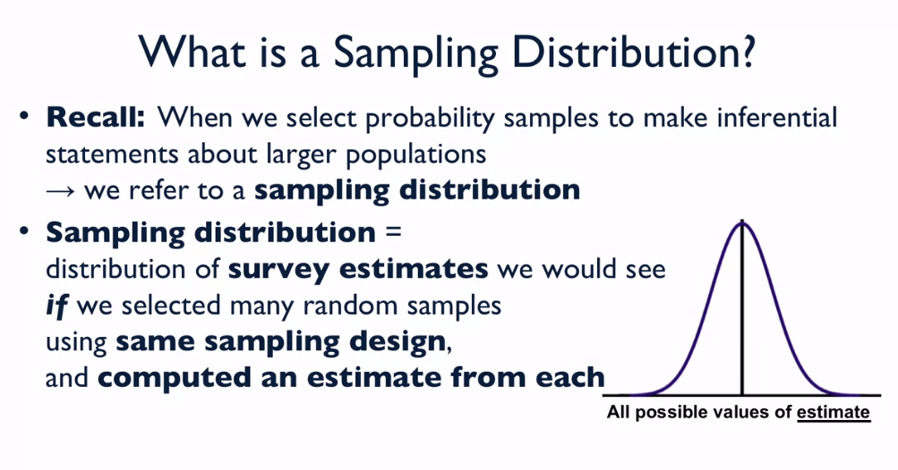

# Building on Visualization Concepts
# Population vs. Samples
## Reading: Building on Visualization Concepts

This week, we will be building on the previous concepts that we have discussed in this course for visualizing data. We are now going to put more of a focus on where data come from, and important concepts related to random sampling as a scientific tool for making inferences about larger populations. With a representative, well-designed random sample of units (people, households, businesses, etc.) from a well-defined target population of interest, we can make sound scientific conclusions about population features of interest (e.g., mean income), and we don’t need a very large sample to do so! However, before we can understand why this is possible, we need to understand the idea of sampling variability, and the uncertainty associated with estimates computed using data collected from random samples. In order to understand sampling variability, we will need to introduce the concept of a sampling distribution, and this is where we are going to build on previous discussions of distributions and random variability.

A key distinction of this week’s material from all previous weeks is that we will now be visualizing distributions of survey estimates based on many hypothetical random samples, rather than distributions of the values on a variable of interest for a given population. In reality, in any given study, we only get to work with one random sample of units. However, the important (and beautiful!) statistical concept of random sampling is that we can use that one sample to estimate features of the sampling distribution that would emerge if we selected multiple random samples using the same techniques. We don’t actually need to draw many random samples, and then examine the distribution of estimates that would emerge after collecting data from every random sample; we just need to draw one, and use the information that we collect from the sample to estimate features of the sampling distribution. This provides us with a sense of the uncertainty in our estimate based on only one sample, and allows us to make conclusions about the value of our target parameter of interest (e.g., mean income) in the larger population.

In order to visualize the distribution of a variable of interest in some population, we need to collect data from as many units as possible in that population, and then plot the distribution of values (e.g., using a histogram). The beautiful property of random sampling is that we can estimate the features of the distribution of estimates that would emerge (again, the sampling distribution) if we selected many random samples using the same design, and we only need one sample to do so. We would not be able to plot (or even estimate!) the distribution of values on a variable of interest by only measuring one unit. This is the wonderful statistical luxury of designing good random samples. This will be the focus of our discussion this week.

Additional Deep-Dive Readings and Web Sites on Random Sampling and Sampling Distributions

* Kish, Leslie. (1965). Survey Sampling. Wiley.
* Lohr, Sharon. (1999). Sampling: Design and Analysis, Second Edition. Cengage Learning.
* [Statistics How-To - Sampling Distribution: Definition, Types, Examples](http://www.statisticshowto.com/sampling-distribution/)
* [What is a Sampling Distribution?](https://www.psychologyinaction.org/psychology-in-action-1/2016/08/13/what-is-a-sampling-distribution)

## Sampling from Well-Defined Populations

## Probability Sampling: Part1

## Probability Sampling: Part2

## Non-Probability Sampling: Part1

## Non-Probability Sampling: Part2

## Potential Pitfalls of Non-Probability Sampling: A Case Study
In Lecture #3 from this week, we provided an overview of non-probability sampling and some of the limitations of this type of approach for generating data and then making inferences about larger populations based on the data. While non-probability sampling methods can generate a lot of data very quickly and at low cost, analysts of the data must be very careful when making population inferences based on the data. There are many pitfalls to making these larger conclusions based on data generated using this technique, and here we consider a rather spectacular failure of this approach for trying to make statements about larger populations.

In 2008, researchers studied the potential of analyzing Google searches to try and understand the spatial and temporal distribution of a flu epidemic. The researchers wanted to see if the analysis of Google searches could effectively replicate the conclusions that CDC researchers were finding based on analyses of data from formal probability samples of the U.S. population. At first, the findings seemed to be almost in exact alignment with the CDC data, and this was viewed as a tremendous success of “big data”. However, these findings were based on a limited window of time. As people continued to study the Google data relative to CDC data, substantial differences emerged, and the Google data was largely viewed as providing a misleading picture of the spread of the flu virus during that time period. This study received a great deal of coverage in the popular press: for more details, take a look at this article: https://www.wired.com/2015/10/can-learn-epic-failure-google-flu-trends/.

The point of this example is not to say that all non-probability samples will lead to erroneous conclusions. When carefully and properly applying one of the two inferential approaches introduced in Lecture #3, one can make sound conclusions about the features of a larger population. In another very popular example, Wang and colleagues analyzed hundreds of thousands of survey responses from Xbox users in 2012, and used a type of calibration weighting approach to make conclusions about voting intentions of the population. Their estimates of preference for presidential candidates in the 2012 election were almost spot-on with forecasts based on aggregation of polling data. For more on this study, please see this link: https://www.sciencedirect.com/science/article/pii/S0169207014000879?via%3Dihub.

In short, it is always important to first ask what type of sampling mechanism was used to generate the data set that is presently under consideration. Then, if non-probability sampling methods were used, careful analyses of how representative that sample is with respect to the target population of interest are necessary before proceeding. We will consider analytic techniques for these types of data in more detail in future lectures.

Additional Deep-Dive Readings on Non-Probability Sampling

Baker, R., Brick, J.M., Bates, N.A., Battaglia, M., Couper, M.P., Dever, J.A., Gile, K.J., and Tourangeau, R. (2013). Report of the AAPOR Task Force on Non-Probability Sampling. American Association for Public Opinion Research, May 2013. Available from www.aapor.org.

Elliott, M.R. and Valliant, R. (2017). Inference for Non-Probability Samples. Statistical Science, 32(2), 249-264.

Pasek, J. (2015). When Will Nonprobability Surveys Mirror Probability Surveys? Considering Types of Inference and Weighting Strategies as Criteria for Correspondence. International Journal of Public Opinion Research. doi:10.1093/ijpor/edv016.

Wang, W., Rothschild, D., Goel, S., and Gelman, A. (2014). Forecasting elections with non-representative polls. International Journal of Forecasting, 31(3), 980-991.

# Probability Samples --> Sampling Distributions

## Sampling Variance & Sampling Distributions: part I

A sampling distribution is the distribution of all possible estimates that would arise from hypothetical repeated sampling, and larger sample sizes will result in a sampling distribution with less variance, meaning that estimates are more precise.

## Sampling Variance & Sampling Distributions: part II

